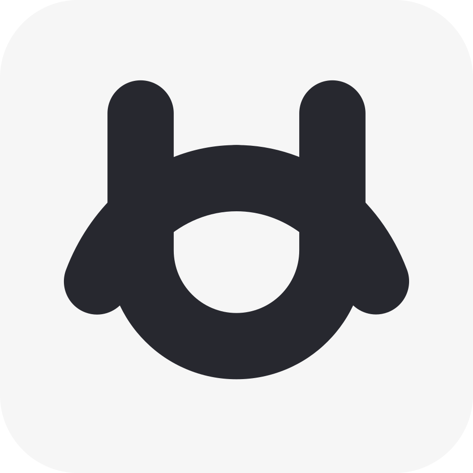

<a id="readme-top"></a>


<!-- PROJECT LOGO -->
<br />
<div align="center">
  <a href="https://github.com/5rang9tan/Using-Session-Manager">
    
  </a>

  <h3 align="center">Using Session Manager</h3>

  <p align="center">
    모든 페이지의 권한을 개별적으로 지정하여 클라이언트 접근 제어 기능을 제공합니다.
    <br />
    <a href="https://cubes.kr><strong>공식 홈페이지 »</strong></a>
    <br />
    <br />
    <a href="mailto:"taeyang@cubes.kr">버그 신고</a>
  </p>
</div>

<!-- ABOUT THE PROJECT -->
## 프로젝트 개요

페이지별 접근 제어는 네트웍 보안에서 중추적인 역할을 하는 기능입니다. 보다 안전한 환경을 조성하기 위해 클라이언트와 연관된 서버의 세션을 검색하고 해당 세션이 데이터베이스에 저장된 값과 일치하는 지, 무결성을 검증 후 클라이언트의 페이지 접근을 인가합니다.

접근 제어 요소:
* 세션 값이 설정되어 있는 지, 확인
* 서버의 세션 값이 데이터베이스와 일치하는 지, 무결성 확인
* 모든 값이 이상이 없으며 페이지의 권한과 클라이언트의 권한이 일치하면, 접근 권한 인가 :smile:

다만, 세션 값 검증을 위해 데이터베이스에 접근함으로써 서버의 오버헤드를 초래할 수 있습니다.
세션 값은 쿠키와 다르게 서버 측에서 구동하는 값이기에 확인할 필요는 없지만, 그냥 만들어봤습니다.

<p align="right">(<a href="#readme-top">back to top</a>)</p>


### 사용 언어

- 
- 
- 
- 

<p align="right">(<a href="#readme-top">back to top</a>)</p>


<!-- GETTING STARTED -->
## 사용 방법
1. UsingSessionManager.php는 include를 통해 DB Connection를 성립하기에, dbcon.php를 우선 구성해야합니다.
필자는 MariaDB를 사용하여 예시를 제공하였습니다.

* dbcon.php - 데이터베이스 커넥션을 성립하는 코드
   ```sh
      <?php
      
      session_start();
      header('Content-Type: text/html; charset=utf-8'); // utf-8인코딩
      
      $db = new mysqli("localhost", "DB_ID", "DB_PASSWORD", "DB_Select"); // db연결, id 및 password
      $db->set_charset("utf8"); // utf-8
      
      function mq($sql)
      {
          global $db;
          return $db->query($sql);
      }
      
      ?>
   ```

2. 기본적으로 UsingSessionManager.php 는 피대상자 페이지에 include 되는 객체입니다. 이에 피대상자 페이지에서 요구하는 권한을 선제적으로 선언해줘야합니다.
다음은 위의 설명을 적용한 예시 코드입니다.

* 피대상자 페이지 - 적절한 권한을 선언하는 페이지
  ```sh
  <?php

  //해당 페이지 권한 설정
  $grant = NULL; //NULL = 공개, member = 회원 전용, teacher = 교사 전용, admin = 관리자 전용
  include("UsingSessionManager.php");
  
  ?>
  ```

<p align="right">(<a href="#readme-top">back to top</a>)</p>


<!-- LICENSE -->
## License

해당 소스코드는 MIT License를 사용합니다. 더 많은 정보는 `LICENSE.txt` 를 참고하십시오.

<p align="right">(<a href="#readme-top">back to top</a>)</p>


<!-- CONTACT -->
## Contact

  <a href="https://instagram.com/5rang9tan">
    
  </a>
  <a href="https://x.com/5rang9tan">
    
  </a>
  <a href="https://threads.net/5rang9tan">
    
  </a>
  <a href="mailto:"taeyang@cubes.kr">
    
  </a>
